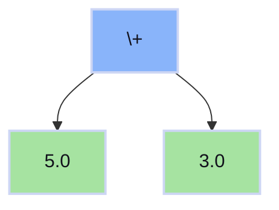
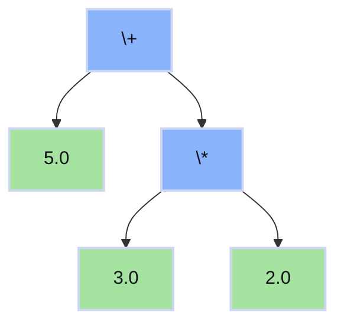
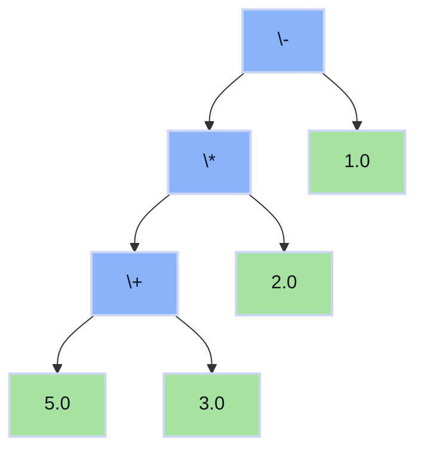

# 🧮 AST Calculator

An example calculator meant to illustrate Abstract Syntax Trees (AST, https://en.wikipedia.org/wiki/Abstract_syntax_tree). This is meant to be a first look at what ASTs are and how they can be used.

## Example Usage 

Run the REPL:
```sh
cargo run
```
Sample session:
```
🧮 AST Calculator REPL
Enter mathematical expressions to see the AST and result.
Examples: '3 + 4 * 2', '(5 - 3) * 2.5', '-10 + 5'
Type 'quit' or 'exit' to close.

>>> 3 + 4 * 2
🌳 AST: Add(Float(3.0), Mul(Float(4.0), Float(2.0)))
✅ Result: 11

>>> (5 - 3) * 2.5
🌳 AST: Mul(Sub(Float(5.0), Float(3.0)), Float(2.5))
✅ Result: 5

>>> 8 / 0
🌳 AST: Div(Float(8.0), Float(0.0))
❌ Evaluation error: Division by zero

>>> quit
👋
```

## Documentation
Generate docs with:
```sh
cargo doc --open
```

## AST Visualization

**How to read these trees:**
- 🔵 **Blue nodes** (\+, \*, \-): All mathematical operations  
- 🟢 **Green nodes** (numbers): Leaf nodes containing actual numbers

### Simple Addition: `5 + 3`



**Evaluation**: `5 + 3 = 8` (single operation)

### Operator Precedence: `5 + 3 * 2`



**Evaluation order**: 
1. `3 * 2 = 6` (multiplication first due to precedence)
2. `5 + 6 = 11` (then addition)

### Parentheses Override Precedence: `(5 + 3) * 2 - 1`



**Evaluation order** (bottom-up):
1. `5 + 3 = 8` (parentheses force addition first)
2. `8 * 2 = 16` (multiplication)
3. `16 - 1 = 15` (subtraction)
